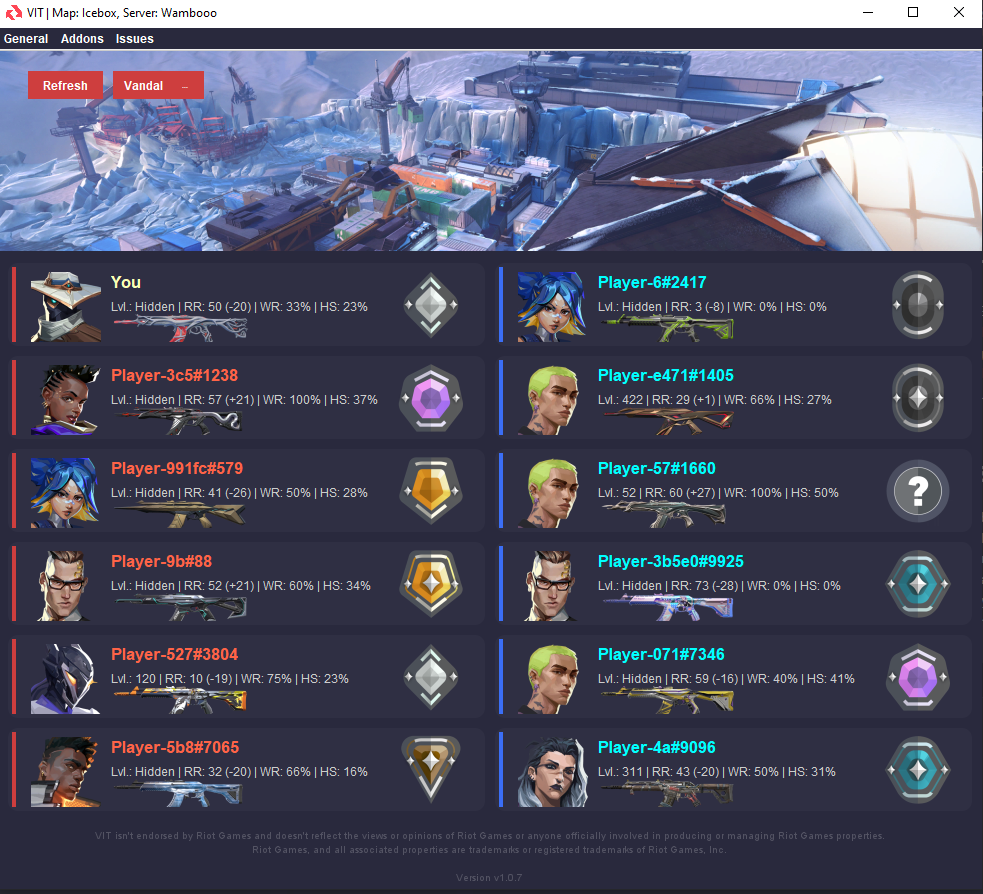
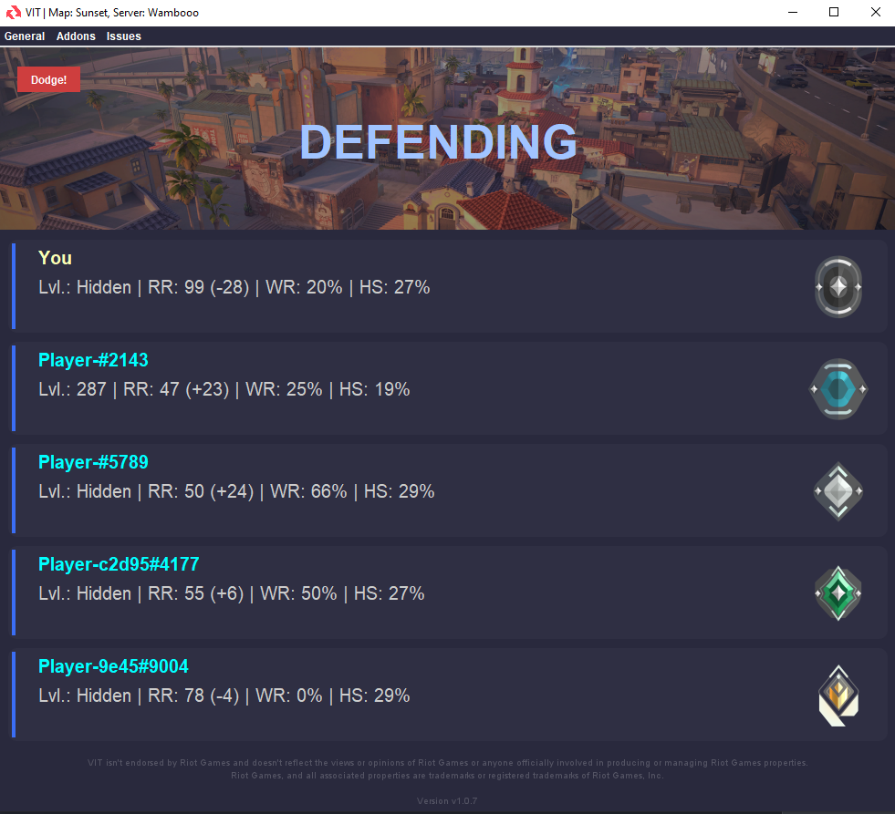
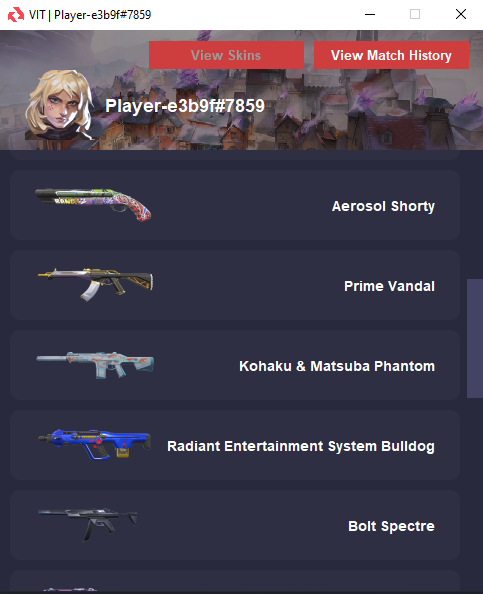
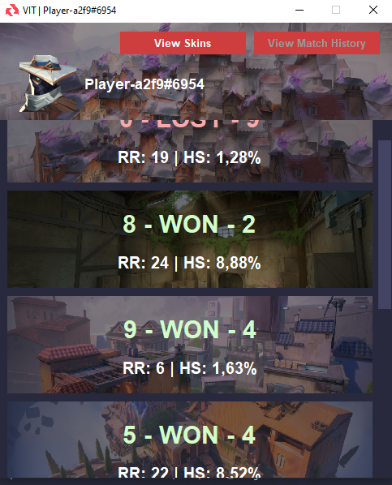

# VIT
**VIT** is a VALORANT Info Viewer showing the **weapon skins**, **stats**, **rr**, and **latest matches** of players inside your lobby.
It's entirely written in Java and **completely automated**. Well, except some actions of course.

  

# What it can do

- View player related information by left-clicking on the player.
  - Shows player skins.
  - Shows latest played competitive matches and their outcomes.
- View how much RR someone has and lost after their last competitive match.
- View headshot, & win-rate of all players.
- View the current and peak rank of all players.
  - Hovering over the peak rank shows you in which season that player achieved that rank.
- Copy player names instantly. (Double right-click on the player)
- Open player stats on tracker.gg instantly. (Middle mouse click on the player)
- Interactable API with [**addon system**](https://github.com/RayzsYT/VIT?tab=readme-ov-file#addons--developer-api).
  

# Requirements

Since VALORANT can only be played on Windows computers, 
VIT can only be used on and is designed to work for **Windows** computers only.
 

Requires at least [**Java 17 or higher**](https://www.oracle.com/de/java/technologies/downloads/#jdk21-windows).
 
Simply use the **x64 Installer** version and install it.

  

# Addons / Developer API

If you press ``WIN + R`` and enter `%appdata%/../local/VIT`,
you'll find an empty folder named ``addons``. You can upload
your very own addons for VIT directly to use them as you wish.

 

On how to create an addon, simply check out the [WIKI](https://github.com/RayzsYT/VIT/wiki/Create-a-VIT-Addon)!

  

# Images

### Live GUI

### Lobby GUI

### Player Window

 

**(!) About these images:**
> These images were created with fake matches and player data.
>   
> If you wish to check for yourself how it would feel to
> use VIT, then feel free to use those command lines as well, to test
> VIT first, instead of trying it inside a live match directly.
>    
> Fake **Live Match** with **10 players**: 
> ``java -jar VIT.jar --test=live --num=12``
>   
> Fake **Lobby** with **5 players**: 
> ``java -jar VIT.jar --test=lobby --num=5``

  

# Commands

``java -jar VIT.jar --test=<mode> --num=<size>``
> Creates a VIT instance with fake data.
>   
> **Mode**: live / lobby
>  
> **Size**: Amount of fake players to generate
>   
> **Example**: ``java -jar VIT.jar --test=live --num=10``

 

``java -jar VIT.jar --load=<file>``
> When you press ``WIN + R`` and enter `%appdata%/../local/VIT/storage/games`, 
> you'll find a folder with files ending with ``.o``. Those files are save-files of the matches you played.
> You can load them using the command above to see them inside VIT once more.
>   
> **Example**: ``java -jar VIT.jar --load=03-13-2026-04-43.o``