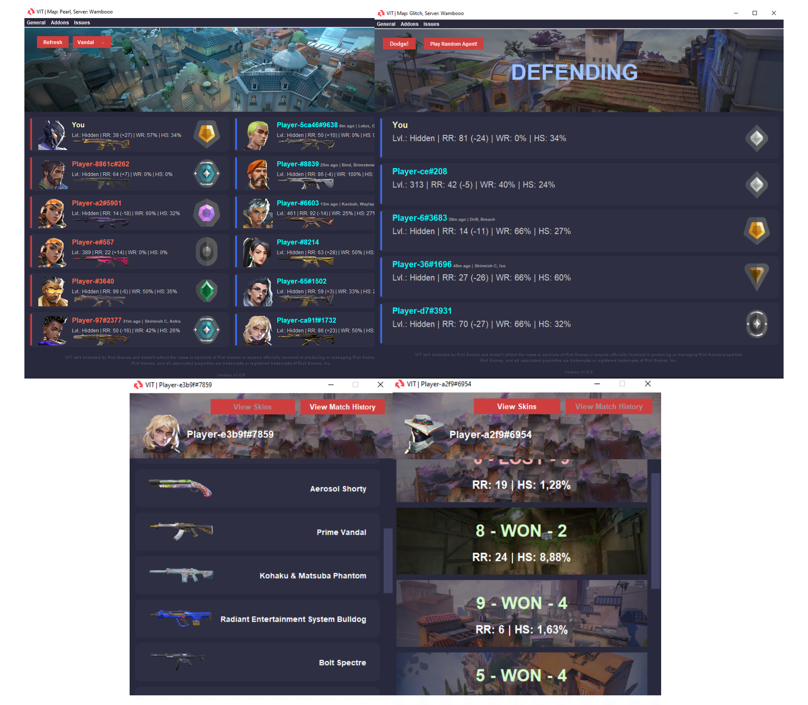

    
     
    <b>VIT</b> is a tool showing the <b>weapon skins</b>, <b>stats</b>, <b>rr</b>, and <b>latest matches</b> of the players inside your <b>VALORANT</b> lobby.

    

<h1 align="center">How it looks like in action</h1>

    

  

# Addons / Developer API

VIT offers you an API to work with to create your very own addons.
 

On how to create an addon, simply check out the [WIKI](https://github.com/RayzsYT/VIT/wiki/Create-a-VIT-Addon)!

 

# Requirements
- A Windows computer (Since VALORANT only runs on Windows)
- VALORANT installed
- ~~At least [**Java 21 or higher**](https://www.oracle.com/de/java/technologies/downloads/#jdk21-windows).~~

**(!) The installation script will install both Java and all necessary libraries automatically. No need to install anything manually.**